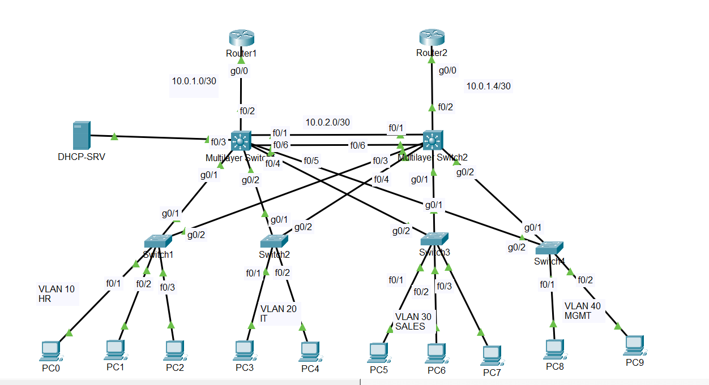

# enterprise-network-lab-packet-tracer

A multi-site enterprise network simulation built in Cisco Packet Tracer, covering core enterprise networking technologies including VLANs, OSPF, HSRP, EtherChannel, and network security features.

## Topology

## VLAN Information

| VLAN | Name | Subnet | Virtual Gateway (HSRP) |
|------|------|--------|----------------------|
| 10 | HR | 192.168.10.0/24 | 192.168.10.1 |
| 20 | IT | 192.168.20.0/24 | 192.168.20.1 |
| 30 | SALES | 192.168.30.0/24 | 192.168.30.1 |
| 40 | MGMT | 192.168.40.0/24 | 192.168.40.1 |
| 99 | Native | - | - |
| 100 | Servers | 192.168.100.0/24 | - |

## Point-to-Point Links

| Link | Subnet | Device A | IP | Device B | IP |
|------|--------|----------|----|----------|----|
| Router1 ↔ MLS1 | 10.0.1.0/30 | Router1 | 10.0.1.1 | MLS1 | 10.0.1.2 |
| Router2 ↔ MLS2 | 10.0.1.4/30 | Router2 | 10.0.1.5 | MLS2 | 10.0.1.6 |
| MLS1 ↔ MLS2 | 10.0.2.0/30 | MLS1 | 10.0.2.2 | MLS2 | 10.0.2.1 |

## Device Information

| Device | Role | IP |
|--------|------|----|
| DHCP-SRV | Centralized DHCP Server | 192.168.100.10 |
| MLS1 | Distribution/Core Switch Site 1 | 10.0.1.2 |
| MLS2 | Distribution/Core Switch Site 2 | 10.0.1.6 |
| Router1 | Edge Router Site 1 | 10.0.1.1 |
| Router2 | Edge Router Site 2 | 10.0.1.5 |

## Technologies Used

- VLANs & 802.1Q Trunking
- Inter-VLAN Routing (Layer 3 switching)
- OSPF (Single Area 0)
- HSRP (Gateway Redundancy)
- EtherChannel LACP (MLS1 ↔ MLS2)
- Rapid PVST+ (STP)
- Centralized DHCP with ip helper-address
- DHCP Snooping & Dynamic ARP Inspection
- Port Security (Sticky MAC, Shutdown)
- PortFast & BPDU Guard
- SSH (All devices)

## Security Features

- Port Security: Sticky MAC, maximum 1 MAC per port, shutdown on violation
- BPDU Guard: Enabled on all access ports
- PortFast: Enabled on all access ports
- DHCP Snooping: Enabled on all access switches
- Dynamic ARP Inspection: Enabled on all access switches
- SSH: Only remote access method, telnet disabled
- OSPF Passive interfaces on all non-routing facing interfaces

## How to Open

1. Download Cisco Packet Tracer (version 8.0 or higher)
2. Clone or download this repository
3. Open the .pkt file in Packet Tracer
4. All configurations are pre-loaded on every device
